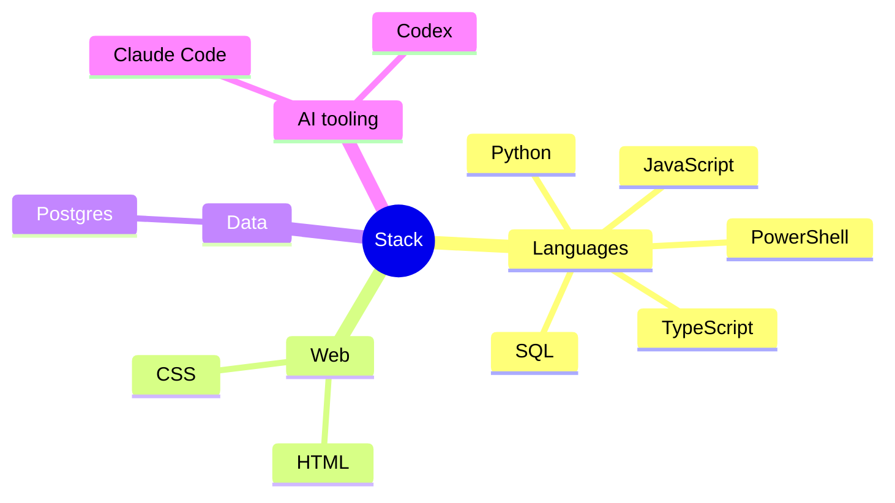

# Lincoln

### AI-native builder — I ship software and business systems by directing AI agent teams.



<p align="center">
  
  
</p>

<p align="center">
  
</p>

<!--AI:START-->
**🤖 AI Coding This Week**

```text
🔤 19.6M input tokens · 178.4K output tokens
🧠 3 sessions · 30 prompts

Opus          12,322,128 tokens     ████████████████░░░░░░░░░   62.4 %
Fable         7,428,380 tokens      █████████░░░░░░░░░░░░░░░░   37.6 %
```

**I'm a Daytime builder, most active on Wednesday** <sub>(commits + AI prompts on record)</sub>

```text
🌞 Morning     141 events            ██░░░░░░░░░░░░░░░░░░░░░░░    6.7 %
🌆 Daytime     878 events            ██████████░░░░░░░░░░░░░░░   41.7 %
🌃 Evening     553 events            ███████░░░░░░░░░░░░░░░░░░   26.3 %
🌙 Night       531 events            ██████░░░░░░░░░░░░░░░░░░░   25.2 %

Monday        180 events            ██░░░░░░░░░░░░░░░░░░░░░░░    8.6 %
Tuesday       405 events            █████░░░░░░░░░░░░░░░░░░░░   19.3 %
Wednesday     769 events            █████████░░░░░░░░░░░░░░░░   36.6 %
Thursday      87 events             █░░░░░░░░░░░░░░░░░░░░░░░░    4.1 %
Friday        528 events            ██████░░░░░░░░░░░░░░░░░░░   25.1 %
Saturday      134 events            ██░░░░░░░░░░░░░░░░░░░░░░░    6.4 %
Sunday        0 events              ░░░░░░░░░░░░░░░░░░░░░░░░░    0.0 %
```
<!--AI:END-->

<p align="center">
  &nbsp;&nbsp;
  &nbsp;&nbsp;
  &nbsp;&nbsp;
  &nbsp;&nbsp;
  &nbsp;&nbsp;
  &nbsp;&nbsp;
  
</p>

<p align="center"><!--UPDATED:START--><sub>Last updated 2026-09-22 15:35 Pacific Daylight Time</sub><!--UPDATED:END--></p>
