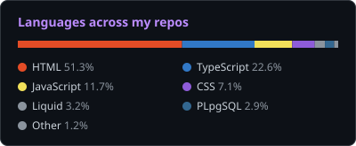
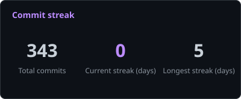
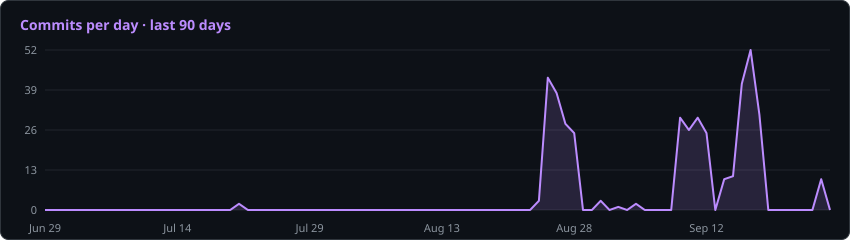

# Lincoln

<p align="center">
  
  
</p>

<p align="center">
  
</p>

<!--AI:START-->
**🤖 AI Coding This Week**

```text
🔤 54.0M input tokens · 295.5K output tokens
🧠 6 sessions · 59 prompts

Opus          46,824,915 tokens     ██████████████████████░░░   86.3 %
Fable         7,428,380 tokens      ███░░░░░░░░░░░░░░░░░░░░░░   13.7 %
```

**I'm a Daytime builder, most active on Wednesday** <sub>(commits + AI prompts on record)</sub>

```text
🌞 Morning     155 events            ██░░░░░░░░░░░░░░░░░░░░░░░    7.3 %
🌆 Daytime     893 events            ██████████░░░░░░░░░░░░░░░   41.9 %
🌃 Evening     553 events            ██████░░░░░░░░░░░░░░░░░░░   25.9 %
🌙 Night       531 events            ██████░░░░░░░░░░░░░░░░░░░   24.9 %

Monday        180 events            ██░░░░░░░░░░░░░░░░░░░░░░░    8.4 %
Tuesday       409 events            █████░░░░░░░░░░░░░░░░░░░░   19.2 %
Wednesday     794 events            █████████░░░░░░░░░░░░░░░░   37.2 %
Thursday      87 events             █░░░░░░░░░░░░░░░░░░░░░░░░    4.1 %
Friday        528 events            ██████░░░░░░░░░░░░░░░░░░░   24.8 %
Saturday      134 events            ██░░░░░░░░░░░░░░░░░░░░░░░    6.3 %
Sunday        0 events              ░░░░░░░░░░░░░░░░░░░░░░░░░    0.0 %
```
<!--AI:END-->

<p align="center">
  &nbsp;&nbsp;
  &nbsp;&nbsp;
  &nbsp;&nbsp;
  &nbsp;&nbsp;
  &nbsp;&nbsp;
  &nbsp;&nbsp;
  
</p>

<p align="center"><!--UPDATED:START--><sub>Last updated 2026-09-24 13:22 Pacific Daylight Time</sub><!--UPDATED:END--></p>
