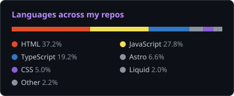
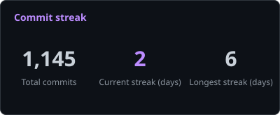
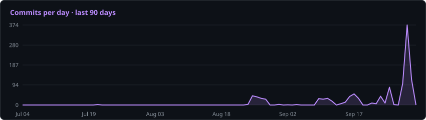

# Lincoln

<p align="center">
  
  
</p>

<p align="center">
  
</p>

<!--AI:START-->
**🤖 AI Coding This Week**

```text
🔤 1.3B input tokens · 4.1M output tokens
🧠 130 sessions · 485 prompts

Opus          862,022,692 tokens    ████████████████░░░░░░░░░   63.9 %
Sonnet        446,953,489 tokens    ████████░░░░░░░░░░░░░░░░░   33.1 %
GPT (Codex)   36,089,391 tokens     █░░░░░░░░░░░░░░░░░░░░░░░░    2.7 %
Haiku         3,874,597 tokens      ░░░░░░░░░░░░░░░░░░░░░░░░░    0.3 %
```

**I'm a Evening builder, most active on Wednesday** <sub>(commits + AI prompts on record)</sub>

```text
🌞 Morning     657 events            ██░░░░░░░░░░░░░░░░░░░░░░░    6.4 %
🌆 Daytime     3,561 events          █████████░░░░░░░░░░░░░░░░   34.7 %
🌃 Evening     3,938 events          ██████████░░░░░░░░░░░░░░░   38.3 %
🌙 Night       2,115 events          █████░░░░░░░░░░░░░░░░░░░░   20.6 %

Monday        1,385 events          ███░░░░░░░░░░░░░░░░░░░░░░   13.5 %
Tuesday       1,177 events          ███░░░░░░░░░░░░░░░░░░░░░░   11.5 %
Wednesday     2,197 events          █████░░░░░░░░░░░░░░░░░░░░   21.4 %
Thursday      1,759 events          ████░░░░░░░░░░░░░░░░░░░░░   17.1 %
Friday        1,904 events          █████░░░░░░░░░░░░░░░░░░░░   18.5 %
Saturday      1,393 events          ███░░░░░░░░░░░░░░░░░░░░░░   13.6 %
Sunday        456 events            █░░░░░░░░░░░░░░░░░░░░░░░░    4.4 %
```
<!--AI:END-->

<p align="center">
  &nbsp;&nbsp;
  &nbsp;&nbsp;
  &nbsp;&nbsp;
  &nbsp;&nbsp;
  &nbsp;&nbsp;
  &nbsp;&nbsp;
  
</p>

<p align="center"><!--UPDATED:START--><sub>Last updated 2026-10-10 18:00 Pacific Daylight Time</sub><!--UPDATED:END--></p>
